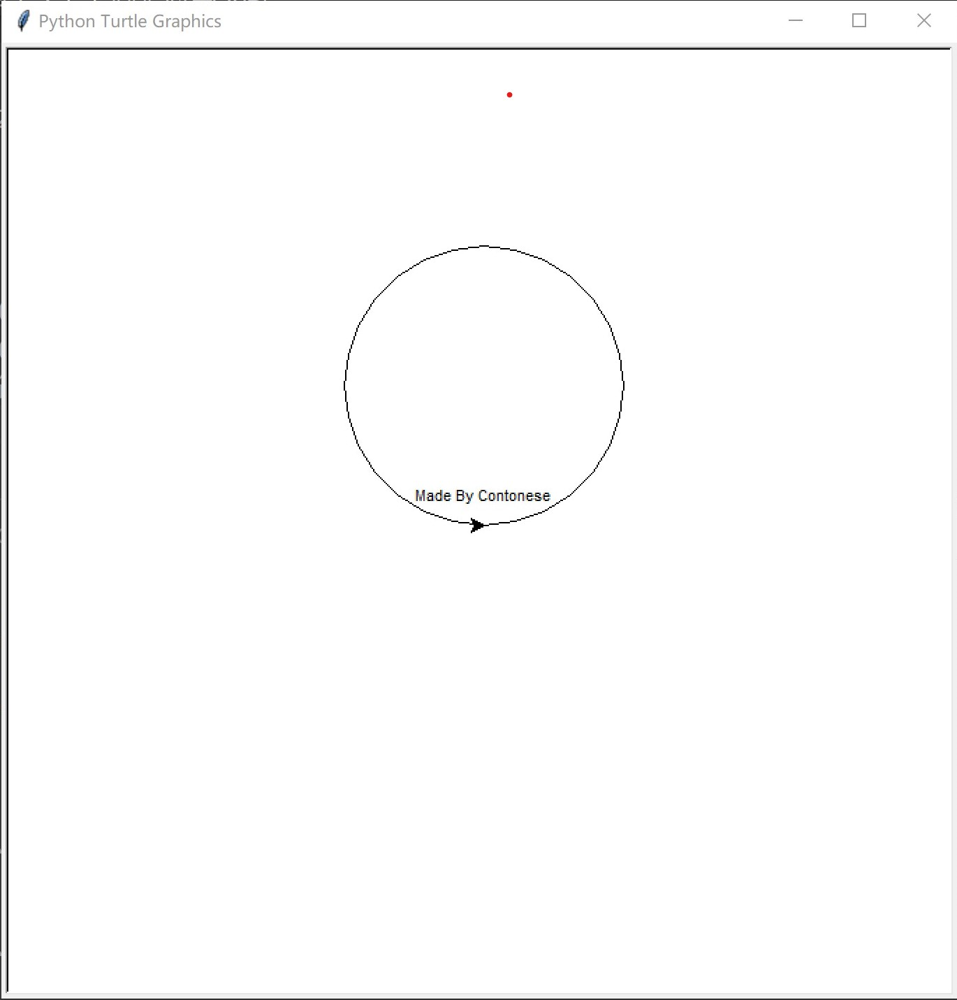

# 引言
什么是粤语编程语言? 它是一门用粤语来与计算机沟通的编程语言。  
在这个语言里，计算机能够读懂你写的粤语。因此，你可以用粤语来操作(虐待)计算机。

# 快速入门
### Hello World
用粤语写的第一个程序Hello World:  
```
畀我睇下 " Hello World! " 点样先?
```
### 赋值语句 
```
讲嘢 |A| 系 1
讲嘢 |B| 系 2
```
### 查看变量类型
```
讲嘢 |A| 系 1
起底: |A|
```
运行结果:  
```
<class 'int'>
```
### 循环
打印从1到100:  
```
讲嘢: |start| 系 0
落操场玩跑步
    讲嘢: |start| 系 |start + 1|
    畀我睇下 |start| 点样先?
玩到 |start < 100| 为止
```
当然也可以使用`For`循环:  
```
|A| 从 1 行到 100
    畀我睇下 |A| 点样先?
行晒
```
### 条件语句
```
讲嘢: |A| 系 2
如果 |A 系 2| 嘅话 -> {
    畀我睇下 "A 系 2" 点样先?
}
唔系嘅话 -> {
    畀我睇下 "A 唔系 2" 点样先?
}
```
### 函数
用Cantonese实现的阶乘:  
```
$factorial |项数| 要做咩:
    如果 |项数 系 0| 嘅话 -> {
        返转头 1
    }
    唔系嘅话 -> {
        返转头 |factorial(项数 - 1) * 项数|
    }
搞掂
```  
返回最大值:  
```
$get_max |数字1, 数字2| 要做咩:
    如果 |数字1 比唔上 数字2| 嘅话 -> {
        返转头 |数字2|
    }
    唔系嘅话 -> {
        返转头 |数字1|
    }
搞掂
```
调用函数:  
```
用下 |get_max(23, 17)|
```
### 抛出异常
```
掟个 |ImportError| 来睇下?
```
### 断言语句
```
谂下: |1 + 1 == 3| ?
```  
运行结果:  
```
Traceback (most recent call last):
    ......
AssertionError
```
### 错误捕捉语句
try-except-finally:  
```
执嘢 -> {
    讲嘢: |A| 系 |B|
}
揾到 |NameError| 嘅话 -> {
    畀我睇下 "揾到NameError" 点样先？
}
执手尾 -> {
    畀我睇下 "执手尾" 点样先？
    讲嘢: |A| 系 1
    讲嘢: |B| 系 1
    畀我睇下 |A, B| 点样先？
}
``` 
### 调用Python库
```
使下 os
使下 math
```
### 面向对象编程
声明对象`duck`, 继承至`object`, 分别有两个方法`游水`和`睡觉`:  
```
咩系 |duck|?
    佢个老豆叫 |object|
    佢识得 |游水| -> {
        畀我睇下 "Duck is swimming" 点样先？
    }
    佢识得 |睡觉| -> {
        畀我睇下 "Duck is sleeping" 点样先？
    }
明白未啊?
```  
调用类中的方法:  
```
用下 |duck().游水()|
用下 |duck().睡觉()|
```
运行结果:  
```
Duck is swimming
Duck is sleeping
```
# 更多例子
### 显示当前时间
```
使下 datetime
畀我睇下 |宜家几点| 点样先？
```
运行结果:  
```
2021-01-17 09:16:20.767191
```
### 暂停
```
使下 time
训阵先 /* 暂停2s */
训 5s /* 暂停5s */
```  
### 来个随机数
```
使下 random
讲嘢: |A| 就 |求其啦|
```
运行结果:  
```
0.15008236307867207
```  
### 海龟绘图
```
老作一下 -> {
    首先: |画个圈(100)|
    跟住: |写隻字("Made By Cantonese\n")|
    最尾: |听我支笛()|
}
```  
运行结果:    
  

### 迷宫小游戏
[代码](examples/game.cantonese)  
运行结果:  


[这里](examples/)查看更多例子.  


# 如何运行?
Cantonese语言运行在Python虚拟机上,环境只支持Python3,因为这才符合广东人先进的思想!  
```shell
python src/cantonese.py [-文件名]
```
将Cantonese转化成Python:  
```
python src/cantonese.py [文件名] -to_py
```
例如:  
```
python src/cantonese.py examples/helloworld.cantonese -to_py
```
运行结果:  
```
print(" Hello World! ")
exit()
```
# TODOs
本项目代码写的很简陋(烂)，欢迎各位粤语与编程爱好者参与讨论与贡献!为粤语文化遗产的保护贡献出自己的一份力量!  
今后要做的是:  
* 完善语法错误检查
* 添加更多语句
* 编写编辑器插件