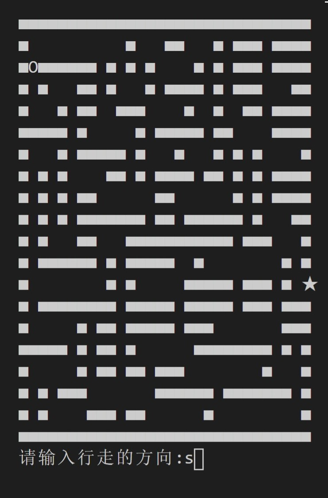

# 粤语编程语言
<a href="#0">引言</a>  
<a href="#1">咋咋淋入门</a>  
&emsp;&emsp;<a href="#2">Hello World</a>  
&emsp;&emsp;<a href="#3">赋值语句 </a>  
&emsp;&emsp;<a href="#4">睇下变量嘅类型</a>  
&emsp;&emsp;<a href="#5">循环</a>  
&emsp;&emsp;<a href="#6">条件语句</a>  
&emsp;&emsp;<a href="#7">函数</a>  
&emsp;&emsp;<a href="#8">抛出异常</a>  
&emsp;&emsp;<a href="#9">断言语句</a>  
&emsp;&emsp;<a href="#10">错误捕捉语句</a>  
&emsp;&emsp;<a href="#11">调用Python库</a>  
&emsp;&emsp;<a href="#12">面向对象编程</a>  
<a href="#13">更多例子</a>  
&emsp;&emsp;<a href="#14">睇睇时间</a>  
&emsp;&emsp;<a href="#15">暂停</a>  
&emsp;&emsp;<a href="#16">嚟个随机数</a>  
&emsp;&emsp;<a href="#17">海龟画图</a>  
&emsp;&emsp;<a href="#18">迷宫游戏仔</a>  
<a href="#19">点样运行?</a>  
<a href="#20">TODOs</a>  
# <a name="0">引言</a>
粤语编程语言系咩? 佢系一门用粤语嚟同计算机沟通嘅编程语言。  
喺呢个语言度，计算机可以读明你写嘅粤语。所以话，你可以用粤语嚟操作(虐待)计算机。

# <a name="1">咋咋淋入门</a>
### <a name="2">Hello World</a>
用粤语写嘅第一个程序Hello World:  
```
畀我睇下 " Hello World! " 点样先?
```
### <a name="3">赋值语句 </a>
```
讲嘢 |A| 系 1
讲嘢 |B| 系 2
```
### <a name="4">睇下变量嘅类型</a>
```
讲嘢 |A| 系 1
起底: |A|
```
运行结果:  
```
<class 'int'>
```
### <a name="5">循环</a>
打印从1到100:  
```
讲嘢: |start| 系 0
落操场玩跑步
    讲嘢: |start| 系 |start + 1|
    畀我睇下 |start| 点样先?
玩到 |start < 100| 为止
```
当然用`For`循环都得:  
```
|A| 从 1 行到 100
    畀我睇下 |A| 点样先?
行晒
```
### <a name="6">条件语句</a>
```
讲嘢: |A| 系 2
如果 |A 系 2| 嘅话 -> {
    畀我睇下 "A 系 2" 点样先?
}
唔系嘅话 -> {
    畀我睇下 "A 唔系 2" 点样先?
}
```
### <a name="7">函数</a>
用 Cantonese 实现嘅阶乘:  
```
$factorial |项数| 要做咩:
    如果 |项数 系 0| 嘅话 -> {
        返转头 1
    }
    唔系嘅话 -> {
        返转头 |factorial(项数 - 1) * 项数|
    }
搞掂
```  
返回最大值:  
```
$get_max |数字1, 数字2| 要做咩:
    如果 |数字1 比唔上 数字2| 嘅话 -> {
        返转头 |数字2|
    }
    唔系嘅话 -> {
        返转头 |数字1|
    }
搞掂
```
调用函数:  
```
用下 |get_max(23, 17)|
```
### <a name="8">抛出异常</a>
```
掟个 |ImportError| 来睇下?
```
### <a name="9">断言语句</a>
```
谂下: |1 + 1 == 3| ?
```  
运行结果:  
```
Traceback (most recent call last):
    ......
AssertionError
```
### <a name="10">错误捕捉语句</a>
try-except-finally:  
```
执嘢 -> {
    讲嘢: |A| 系 |B|
}
揾到 |NameError| 嘅话 -> {
    畀我睇下 "揾到NameError" 点样先？
}
执手尾 -> {
    畀我睇下 "执手尾" 点样先？
    讲嘢: |A| 系 1
    讲嘢: |B| 系 1
    畀我睇下 |A, B| 点样先？
}
``` 
### <a name="11">调用 Python 库</a>
```
使下 os
使下 math
```
### <a name="12">面向对象编程</a>
声明对象`duck`, 继承至`object`, 分别有两个方法`游水`同埋`睡觉`, 仲有一个属性`性别`:  
```
咩系 |duck|?
    佢个老豆叫 |object|
    佢嘅 |性别| 系 "公"
    佢识得 |游水| -> {
        畀我睇下 "Duck is swimming" 点样先？
    }
    佢识得 |睡觉| -> {
        畀我睇下 "Duck is sleeping" 点样先？
    }
明白未啊?
```  
调用类中嘅方法:  
```
用下 |duck().游水()|
用下 |duck().睡觉()|
```
运行结果:  
```
Duck is swimming
Duck is sleeping
```
# <a name="13">更多例子</a>
### <a name="14">显示当前时间</a>
```
使下 datetime
畀我睇下 |宜家几点| 点样先？
```
运行结果:  
```
2021-01-17 09:16:20.767191
```
### <a name="15">暂停</a>
```
使下 time
瞓阵先 /* 暂停2s */
瞓 5s /* 暂停5s */
```  
### <a name="16">嚟个随机数</a>
```
使下 random
讲嘢: |A| 就 |求其啦|
```
运行结果:  
```
0.15008236307867207
```  
### <a name="17">海龟绘图</a>
```
老作一下 -> {
    首先: |画个圈(100)|
    跟住: |写隻字("Made By Cantonese\n")|
    最尾: |听我支笛()|
}
```  
运行结果:    
  

### <a name="18">迷宫游戏仔</a>
[代码](examples/game.cantonese)  
运行结果:  



[喺呢度](examples/)睇下更多例子.  


# <a name="19">点样运行?</a>
Cantonese 语言运行喺 Python 虚拟机上，环境净系支持 Python3，因为噉先符合广东人先进嘅思想!  
```shell
python src/cantonese.py [-文件名]
```
将 Cantonese 转化成 Python:  
```
python src/cantonese.py [文件名] -to_py
```
例如:  
```
python src/cantonese.py examples/helloworld.cantonese -to_py
```
运行嘅结果系:  
```
print(" Hello World! ")
exit()
```
# <a name="20">TODOs</a>
本项目代码写得很陋(烂)，欢迎各个粤语同埋编程爱好者一齐讨论同贡献！为粤语文化遗产嘅保护贡献出自己嘅一份力量！
今后要做咩:  
* 完善语法错误检查
* 加多啲语句
* 编写编辑器插件
